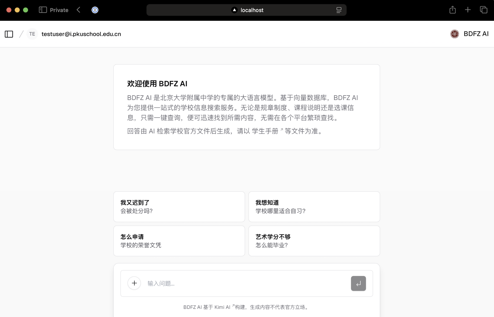
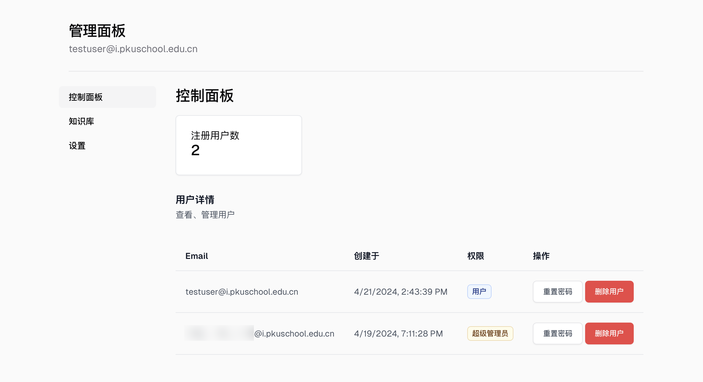
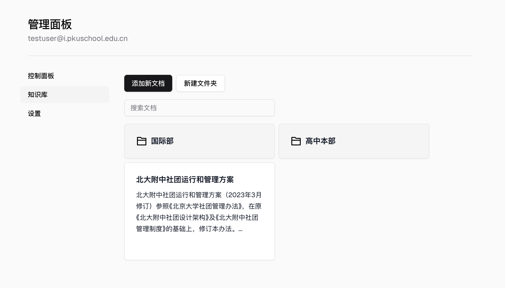
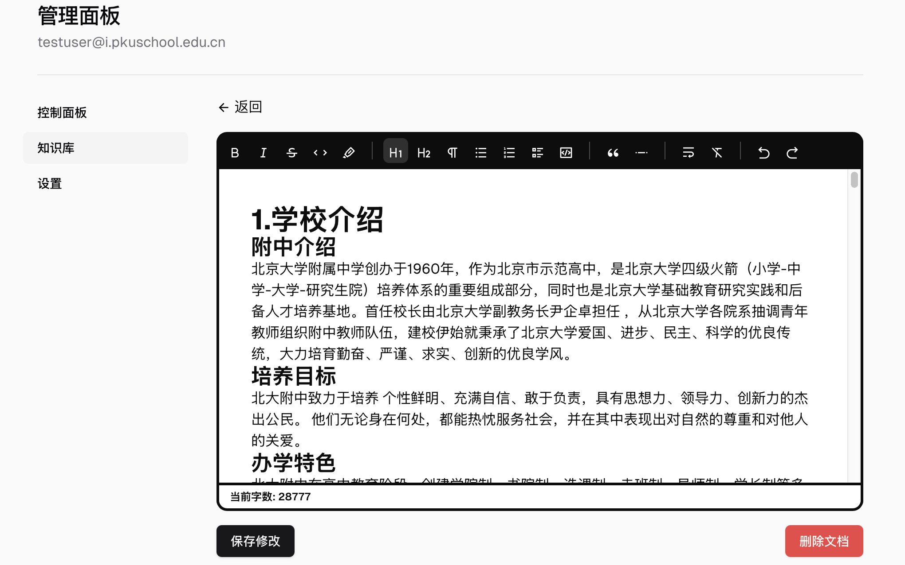

# Enterprise RAG Template  
  

用于企业、组织的 RAG (检索增强生成) 模板  
Built with Next.js + LangChain

- 内置管理后台，可配置注册邮箱域
- 可视化内部文档管理面板，支持 Markdown
- 文本补全适配 OpenAI API 格式语法，可适配 Kimi AI、阿里巴巴通义千问文本向量等接口，满足合规性要求
- 支持演示模式  

用户管理：
  

知识库管理：
  

可视化 Markdown 编辑器

## 使用方法  
请先 clone 本仓库或下载 zip 文件  

1. 在 `siteConfig.ts` 中配置基础内容
2. `/public` 下放置 `icon.png`
3. 在 .env 中配置相应的环境变量
3. 确保 Docker 和 Docker Compose 已安装
4. 运行 `docker-compose up --build -d` 启动服务 （后续可省略 --build flag)

## Acknowledgements  
- [Vercel Next.js AI Chatbot](https://vercel.com/templates/next.js/nextjs-ai-chatbot)
